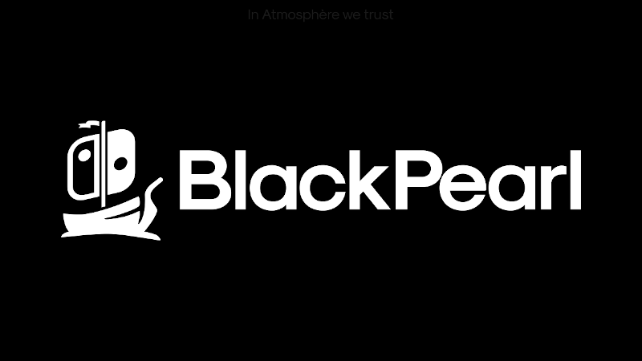

## About
We create the BPbuilder from the idea of DeepSea to build Black Pearl AIO package. 
Our AIO package are available on [releases](https://github.com/bpcommunity/blackpearl-aio/releases).
Take care to avoid any problematic stuff, we are not responsible for any problems that you can have.

It is expected that the package works with any device capable. We use a scheme to load *payload.bin* with
different devices without changes. Don't forget to update your device *payload.bin* with the most recent
one.

# Recomendations
We recomend the package usage with some configurations:

* FAT32 (SD card)
* emuMMC (partition or file based)

The package expects that you use it on that way. To open HBMenu, **hold R** and open the Album.

## Packages on Release

We provide an AIO package named BlackPearl as the infamous ship from Captain
Jack Sparrow. It's just for fun, focus our work on stability, simplicity and cleanness.
Our default package has:

| Software                                                         	| Pearl Edition 	|
|------------------------------------------------------------------	|:-------------:	|
| [Atmosphère](https://github.com/Atmosphere-NX/Atmosphere)        	|       ✅       	|
| [Hekate](https://github.com/CTCaer/hekate)                       	|       ✅       	|
| [JKSV](https://github.com/J-D-K/JKSV)                            	|       ✅       	|
| [NX-Shell](https://github.com/joel16/NX-Shell)                   	|       ✅       	|
| [FTPd](https://github.com/mtheall/ftpd)                          	|       ✅       	|
| [Tinfoil](https://tinfoil.io)                                    	|       ✅       	|
| [DBI](https://github.com/rashevskyv/dbi)                         	|       ✅       	|
| [NX-Activity-Log](https://github.com/tallbl0nde/NX-Activity-Log) 	|       ✅       	|
| [Patches](https://github.com/ITotalJustice/patches)              	|       ✅       	|

All software used is public on the Internet, and we just merge them. Our intention is
for study only and to use everything as intended to be used.

## Credits
* Thanks to DeepSea Team, it helps us a lot on our own builder.
* And a huge thanks to all the awesome homebrew developers!
